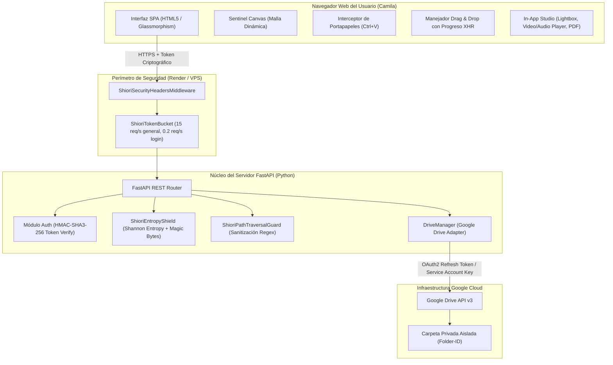
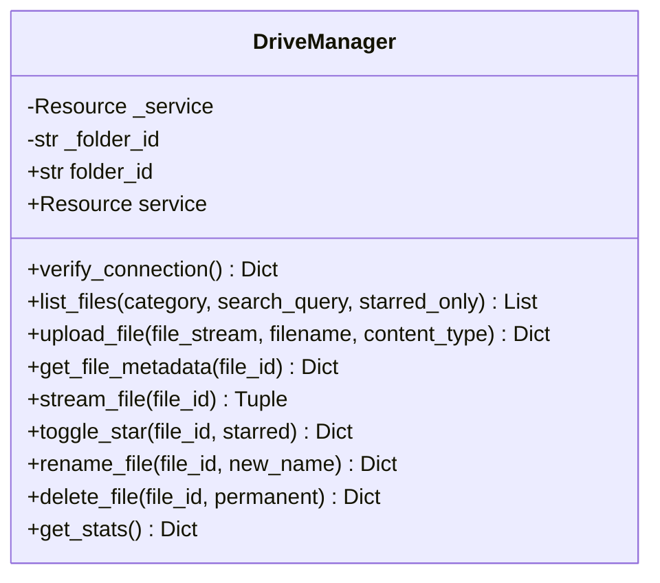
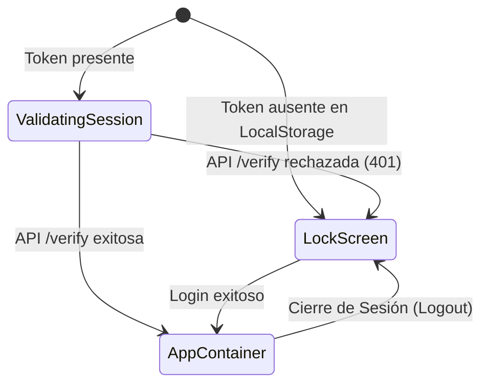
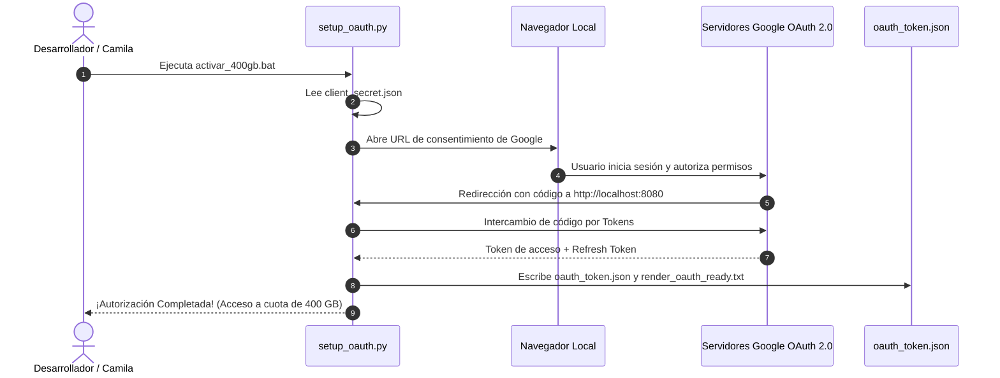

# 💖 Nube Privada de Camila ✨ — Documentación Técnica, Funcional y de Arquitectura Exhaustiva (v2.0.0)

> **Documento Maestro del Proyecto**  
> **Versión:** 2.0.0 (Edición Ultra-Detallada)  
> **Sistema Operativo Soportado:** Windows / Linux / macOS (Desarrollo local) — Linux/Container (Producción)  
> **Módulos de Ciberdefensa:** Shiori Sentinel v14.0 Cloud Shield Integration  
> **Infraestructura Cloud:** Google Drive API v3 (OAuth 2.0 & Service Accounts)  

---

## 📑 Tabla de Contenidos

1. [Ficha Técnica del Proyecto y Resumen Ejecutivo](#1-ficha-técnica-del-proyecto-y-resumen-ejecutivo)
2. [Arquitectura del Sistema y Diagramas de Flujo de Datos](#2-arquitectura-del-sistema-y-diagramas-de-flujo-de-datos)
3. [Módulo de Ciberdefensa Shiori Sentinel v14.0 (`shiori_guard.py`)](#3-módulo-de-ciberdefensa-shiori-sentinel-v140-shiori_guardpy)
4. [Mecanismo Criptográfico y Gestión de Sesiones (`auth.py`)](#4-mecanismo-criptográfico-y-gestión-de-sesiones-authpy)
5. [Gestor de Almacenamiento Google Drive v3 (`drive_manager.py`)](#5-gestor-de-almacenamiento-google-drive-v3-drive_managerpy)
6. [Gestión Centralizada de Configuración (`config.py`)](#6-gestión-centralizada-de-configuración-configpy)
7. [Servidor FastAPI y Especificación OpenAPI de la REST API (`main.py`)](#7-servidor-fastapi-y-especificación-openapi-de-la-rest-api-mainpy)
8. [Arquitectura Frontend: Componentes, Estado y Lógica Reactiva (`app.js`)](#8-arquitectura-frontend-componentes-estado-y-lógica-reactiva-appjs)
9. [Resolución Dinámica de Red y Detección de Entorno (`config.js`)](#9-resolución-dinámica-de-red-y-detección-de-entorno-configjs)
10. [Diseño Visual: Obsidian & Rose-Lavender Glassmorphism (`style.css`)](#10-diseño-visual-obsidian--rose-lavender-glassmorphism-stylecss)
11. [Herramientas Auxiliares, Scripts de Automatización y Flujo OAuth](#11-herramientas-auxiliares-scripts-de-automatización-y-flujo-oauth)
12. [Manifiestos de Despliegue en la Nube (Render, Vercel, Railway)](#12-manifiestos-de-despliegue-en-la-nube-render-vercel-railway)
13. [Matriz de Seguridad: Vectores de Amenaza y Estrategias Defensivas](#13-matriz-de-seguridad-vectores-de-amenaza-y-estrategias-defensivas)
14. [Manual de Operación, Mantenimiento y Resolución de Incidencias](#14-manual-de-operación-mantenimiento-y-resolución-de-incidencias)

---

## 1. Ficha Técnica del Proyecto y Resumen Ejecutivo

### 1.1 Ficha Técnica

| Atributo | Detalle Técnico |
| :--- | :--- |
| **Nombre del Sistema** | Nube Privada de Camila (Camila's Cloud) |
| **Versión del Código** | `2.0.0` |
| **Paradigma** | Arquitectura Desacoplada: Single Page Application (SPA) + API RESTful Asíncrona |
| **Lenguaje Backend** | Python 3.10+ (Tipado estricto con Pydantic v2 y Type Hints) |
| **Framework Backend** | FastAPI `>= 0.110.0` montado sobre servidor ASGI Uvicorn `>= 0.28.0` |
| **Lenguaje Frontend** | JavaScript nativo moderno (ES6+, Vanilla JS modular), HTML5 Semántico, CSS3 |
| **Motor de Almacenamiento** | Google Drive API v3 (Protocolo HTTP/2 vía Google API Client Library) |
| **Mecanismo de Conexión Drive** | Híbrido: OAuth 2.0 (Cuotas personales de 15 GB a 400 GB) / Service Account RSA |
| **Ciberdefensa y Blindaje** | Shiori Sentinel v14.0 (Zero-Trust Crypto, Token Bucket Limiter, Entropy Shield) |
| **Entorno de Producción** | Backend en Render (Web Service) + Frontend en Vercel / GitHub Pages |

### 1.2 Resumen Ejecutivo y Misión
La **Nube Privada de Camila** surge ante la necesidad de proveer un entorno de almacenamiento digital en la nube que elimine la frialdad corporativa, la publicidad intrusiva y las interfaces impersonales de las grandes empresas, proporcionando a su vez **un nivel de seguridad y ciberdefensa significativamente más alto** que el de las aplicaciones comunes.

A diferencia de un simple cliente web que expone claves de API en el código fuente del navegador, esta solución encapsula toda la interacción con la infraestructura de Google Drive detrás de un servidor perimetral blindado. Este servidor valida criptográficamente cada solicitud, inspecciona la entropía y las firmas binarias de los archivos entrantes, previene inyecciones de directorios, realiza *streaming* binario en fragmentos controlados para evitar la saturación de memoria RAM, y sincroniza metadatos y favoritos directamente con los atributos nativos de la nube de Google.

---

## 2. Arquitectura del Sistema y Diagramas de Flujo de Datos

### 2.1 Diagrama Global de la Arquitectura



### 2.2 Flujo de Petición HTTP Típica con Streaming Multimedia
Cuando Camila solicita previsualizar un video o escuchar una canción:
1. El navegador genera una petición `GET /api/files/{file_id}/preview?token=...`.
2. `ShioriSecurityHeadersMiddleware` inyecta las cabeceras defensivas (`nosniff`, `SAMEORIGIN`, `X-Shiori-Protection`).
3. `ShioriRateLimiter` extrae la dirección IP del cliente y valida si el bucket dispone de fichas.
4. `require_auth` extrae el parámetro `token`, valida la firma `HMAC-SHA3-256` en tiempo constante contra `SECRET_KEY`, comprueba la fecha de expiración (`exp`) y retorna el contexto de identidad.
5. `drive_manager.stream_file(file_id)`:
   - Realiza una llamada a `files().get(fileId=..., fields='parents')` para garantizar el **Aislamiento de Carpeta**.
   - Invoca `MediaIoBaseDownload` en un generador asíncrono con *buffer* rotativo de **256 KB**.
6. FastAPI retorna un `StreamingResponse` con cabeceras `Content-Disposition: inline`, `Accept-Ranges: bytes` y el tipo MIME exacto, transmitiendo los bytes conforme el reproductor multimedia los requiere, sin almacenar el archivo completo en el disco ni en la memoria del servidor.

### 2.3 Flujo de Subida de Archivos con Inspección Proactiva
1. Camila arrastra un archivo o presiona `Ctrl + V` con una captura en el portapapeles.
2. `XMLHttpRequest` inicia una petición multipart `POST /api/upload` emitiendo eventos `onprogress` hacia la barra de progreso en pantalla.
3. El middleware valida el límite de tasa de la IP.
4. `require_auth` valida la firma criptográfica del token de Camila.
5. `shiori_guard.sanitize_filename()` neutraliza rutas relativas (`../`), caracteres nulos y símbolos reservados.
6. `shiori_entropy.scan_file_buffer()`:
   - Verifica si la extensión está prohibida (.exe, .bat, .sh, etc.).
   - Lee los primeros 64 bytes (*Magic Bytes*) para detectar ejecutables enmascarados (PE, ELF, Mach-O, scripts PHP o binarios de terminal).
   - Calcula la entropía de Shannon del archivo.
7. Si el archivo es declarado seguro, `drive_manager.upload_file()` ejecuta un `MediaIoBaseUpload` con protocolo **Resumable Upload** en bloques de **5 MB**, insertando el archivo dentro de la carpeta cuyo identificador se encuentra en `Folder-ID.txt`.
8. Se categoriza el archivo, se actualizan las métricas y se retorna un JSON de confirmación que la interfaz utiliza para actualizar la vista de forma reactiva con una notificación *Toast*.

---

## 3. Módulo de Ciberdefensa Shiori Sentinel v14.0 (`shiori_guard.py`)

Ubicación del archivo: [`backend/shiori_guard.py`](file:///c:/Cloud/backend/shiori_guard.py)  
Total de líneas: 182 | Dependencias: `math`, `time`, `hmac`, `hashlib`, `re`, `collections.defaultdict`, `fastapi`, `starlette`.

Este módulo adapta los mecanismos de ciberdefensa activa del sistema Shiori Sentinel v14 para proteger la nube privada contra ataques automatizados, inyecciones y cargas de archivos maliciosos.

```
┌─────────────────────────────────────────────────────────────────────────────┐
│                    SHIORI SENTINEL v14.0 — CLOUD SHIELD                     │
├──────────────────────┬──────────────────────────────────────────────────────┤
│ [ZTA] ZeroTrustCrypto│ Firmas HMAC-SHA3-256 (Keccak, construcción de esponja) │
├──────────────────────┼──────────────────────────────────────────────────────┤
│ [TBR] TokenBucket    │ Rate Limiter dinámico por IP con reloj monotónico    │
├──────────────────────┼──────────────────────────────────────────────────────┤
│ [ENT] EntropyShield  │ Entropía de Shannon (0-8 bits) + Magic Bytes filter  │
├──────────────────────┼──────────────────────────────────────────────────────┤
│ [PTG] PathTraversal  │ Purga de null bytes (\0), ../ y caracteres shell    │
├──────────────────────┼──────────────────────────────────────────────────────┤
│ [SEC] SecurityHeaders│ Middleware de cabeceras HTTP restrictivas            │
└──────────────────────┴──────────────────────────────────────────────────────┘
```

### 3.1 [ZTA] Zero-Trust Crypto Engine (`ShioriZeroTrustCrypto`)
- **Algoritmo**: `HMAC-SHA3-256` (Keccak).
- **Ventaja Técnica**: SHA-3 utiliza la construcción de esponja (*sponge construction*), que internamente es inmune a ataques de extensión de longitud sin depender de la construcción HMAC. No obstante, la protección contra *length extension attacks* en la práctica la aporta la **construcción HMAC en sí misma** (con cualquier hash subyacente, incluido SHA-2). La seguridad post-cuántica de HMAC depende principalmente de la **longitud de la clave** (256 bits ≈ 128 bits de seguridad post-cuántica vía Grover), no de la familia de hash elegida. SHA-3 se mantiene como elección conservadora y alineada con las recomendaciones del NIST.
- **Comparación Temporal**: El método `verify_signature` delega la comprobación en `hmac.compare_digest(expected, signature)`, garantizando que el tiempo de comparación sea idéntico sin importar en qué carácter falle la coincidencia, anulando cualquier posibilidad de explotación por canales laterales (*Side-Channel Timing Attacks*).

### 3.2 [TBR] Token Bucket Rate Limiter (`ShioriTokenBucket` y `ShioriRateLimiter`)
El algoritmo de Token Bucket implementado permite absorber ráfagas legítimas de peticiones sin penalizar al usuario, mientras estrangula el tráfico abusivo continuo:

$$\text{Tokens}_{\text{actuales}} = \min\left(\text{Capacidad}, \text{Tokens}_{\text{previos}} + (t_{\text{ahora}} - t_{\text{último}}) \times \text{Tasa de Recarga}\right)$$

- **Precisión Monotónica**: Utiliza `time.monotonic()` en lugar de `time.time()`. El reloj monotónico es inmune a sincronizaciones de servidor (NTP) o cambios manuales de hora, evitando que el limitador se congele o libere fichas indebidamente.
- **Doble Nivel de Protección por IP**:
  1. **Bucket General (`_buckets`)**:
     - Capacidad máxima: `15.0` tokens.
     - Tasa de recarga: `1.5` tokens por segundo.
     - Destinado a navegación, carga de miniaturas, filtrado y consultas de estadísticas.
  2. **Bucket de Autenticación (`_login_buckets`)**:
     - Capacidad máxima: `5.0` tokens.
     - Tasa de recarga: `0.2` tokens por segundo ($1\text{ ficha cada }5\text{ segundos}$).
     - Si un atacante intenta realizar ataques de diccionario contra `/api/auth/login`, agotará las 5 fichas en menos de un segundo y recibirá respuestas HTTP `429 Too Many Requests` durante los siguientes periodos de recarga.

### 3.3 [ENT] Entropy Shield y Análisis de Magic Bytes (`ShioriEntropyShield`)

#### 3.3.1 Cálculo de la Entropía de Shannon
La entropía mide el desorden o la aleatoriedad de la distribución de bytes en un flujo binario. Su fórmula viene dada por:

$$H(X) = -\sum_{i=0}^{255} p(b_i) \cdot \log_2(p(b_i))$$

Donde $p(b_i)$ es la frecuencia relativa del byte $b_i$ dentro del archivo ($0 \le H(X) \le 8.0\text{ bits/byte}$):
- Archivos de texto plano o ejecutables descompilados suelen tener $H(X) \approx 3.5 - 5.0$.
- Archivos cifrados con algoritmos fuertes o empaquetadores sospechosos (*packers* estilo UPX) suelen registrar $H(X) > 7.5$.
El motor calcula este índice en memoria analizando el array de frecuencias relativas de los 256 posibles valores de un byte.

#### 3.3.2 Lista Negra de Extensiones Peligrosas
Se rechaza cualquier archivo cuyo nombre finalice en:
```python
dangerous_exts = (".exe", ".bat", ".cmd", ".ps1", ".vbs", ".sh", ".py", ".php", ".phtml", ".dll", ".so")
```
Esto mitiga la posibilidad de que un usuario suba scripts ejecutables que puedan correr inadvertidamente en algún equipo cliente o servidor de sincronización.

#### 3.3.3 Inspección de Cabeceras Binarias (Magic Bytes)
Los atacantes suelen renombrar binarios ejecutables para camuflarlos (por ejemplo, cambiar `payload.exe` a `recuerdo.jpg`). Shiori Sentinel analiza los primeros 64 bytes de la cabecera del archivo:

| Firma Binaria (Bytes) | Identificador | Tipo de Amenaza Bloqueada |
| :--- | :--- | :--- |
| `b"MZ"` (`0x4D 0x5A`) | Cabecera DOS / Windows PE | Ejecutable de Windows (`.exe`, `.dll`, `.sys`) |
| `b"\x7fELF"` (`0x7F 0x45 0x4C 0x46`) | ELF Header | Binario ejecutable de Linux / Unix |
| `b"\xca\xfe\xba\xbe"` (`0xCA 0xFE 0xBA 0xBE`) | Java Bytecode / Mach-O Fat Binary | Binarios de macOS o applets Java compilados |
| `b"<?php"` (`0x3C 0x3F 0x70 0x68 0x70`) | PHP Script Tag | Web shells y scripts maliciosos de servidor |
| `b"#!"` (`0x23 0x21`) | Shebang Header | Scripts de Bash, Python o Perl ejecutables |

*Nota de excepción*: Si el archivo termina legítimamente en `.txt`, se permite su almacenamiento aunque contenga caracteres de control o formato script, permitiendo a Camila guardar notas de código o apuntes personales.

### 3.4 [PTG] Path Traversal Guard (`ShioriPathTraversalGuard`)
El método estático `sanitize_filename(filename)` ejecuta tres fases de saneamiento:
1. **Purga de Secuencias de Escape**: `re.sub(r"\.\.[/\\]", "", filename)` elimina secuencias como `../../` o `..\..\` que intenten escribir o referenciar rutas relativas fuera del alcance permitido.
2. **Purga de Bytes Nulos**: Elimina `\0` (`0x00`), evitando ataques de truncamiento de cadenas en capas de bajo nivel de sistemas operativos basados en C/C++.
3. **Restricción de Caracteres Reservados**: Reemplaza cualquier coincidencia de `[<>:"/\\|?*]` por un guión bajo `_`.
4. **Respaldo por Defecto**: Si tras la purga el nombre queda vacío, se le asigna de manera segura `archivo_seguro`.

### 3.5 [SEC] Cabeceras de Seguridad HTTP (`ShioriSecurityHeadersMiddleware`)
Montado como middleware de Starlette/FastAPI, intercepta cada petición saliente e inyecta:
- `X-Shiori-Protection: v14.0-Sentinel-Active` (Firma de auditoría interna).
- `X-Content-Type-Options: nosniff` (Impide que los navegadores interpreten archivos binarios como código HTML/JS ejecutable).
- `X-Frame-Options: SAMEORIGIN` (Bloquea que la aplicación sea embebida dentro de `<iframe>` en sitios de terceros, erradicando ataques de *Clickjacking*).
- `Referrer-Policy: strict-origin-when-cross-origin` (Protege las URLs internas al navegar hacia enlaces externos).
- `X-XSS-Protection: 1; mode=block` (Activa el filtro proactivo anti-XSS en navegadores legados).

---

## 4. Mecanismo Criptográfico y Gestión de Sesiones (`auth.py`)

Ubicación del archivo: [`backend/auth.py`](file:///c:/Cloud/backend/auth.py)  
Total de líneas: 124 | Dependencias: `time`, `json`, `base64`, `hmac`, `hashlib`, `fastapi`.

El sistema de autenticación de la Nube Privada prescinde deliberadamente de librerías de terceros complejas o de bases de datos pesadas, implementando un generador y validador de tokens criptográficos autocontenidos basados en `HMAC-SHA3-256` (Keccak), el mismo algoritmo utilizado por el motor `ShioriZeroTrustCrypto`.

### 4.1 Estructura del Token de Sesión
El token generado por `create_access_token()` adopta la sintaxis:

$$\text{Token} = \langle \text{Payload}_{\text{base64url}} \rangle \,.\, \langle \text{Firma}_{\text{base64url}} \rangle$$

#### Estructura del Payload JSON
```json
{
  "sub": "camila",
  "iat": 1772740000,
  "exp": 1775332000
}
```
- `sub`: Identificador de sujeto o usuario (`camila`).
- `iat`: Timestamp UNIX exacto de emisión (*Issued At*).
- `exp`: Timestamp UNIX de expiración calculado como $\text{iat} + 2{,}592{,}000\text{ segundos}$ ($30\text{ días}$).

#### Cálculo de la Firma Criptográfica
```python
signature = hmac.new(
    SECRET_KEY.encode("utf-8"),
    payload_b64.encode("utf-8"),
    hashlib.sha3_256
).digest()
```

### 4.2 Verificación de Integridad y Expiración (`verify_token`)
El proceso de verificación sigue un algoritmo estricto de 4 pasos:
1. **Verificación de Formato**: Comprueba que la cadena contenga exactamente un carácter separador punto (`.`).
2. **Re-cálculo de Firma**: Calcula la firma esperada sobre `payload_b64` usando la variable de entorno `SECRET_KEY`.
3. **Comparación en Tiempo Constante**: Ejecuta `hmac.compare_digest(sig_b64, expected_sig_b64)`. Si las firmas difieren en un solo bit, lanza HTTP 401 Unauthorized (`"Firma de token inválida"`).
4. **Validación Temporal**: Decodifica el payload y evalúa `if time.time() > payload["exp"]`. Si la fecha actual ha superado el límite, lanza HTTP 401 Unauthorized (`"La sesión ha expirado, por favor ingresa nuevamente"`).

### 4.3 Dependencia de Inyección FastAPI (`require_auth`)
La función `require_auth` implementa la extracción del token evaluando 3 fuentes en orden jerárquico:
1. **Cabecera `Authorization`**: Prefijo `Bearer <token>`.
2. **Cabecera `X-Auth-Token`**: `<token>` directo.
3. **Parámetro URL `Query(?token=...)`**:
   *Importancia crítica*: Los elementos HTML como ``, `<video src="...">`, `<audio src="...">` y `<a href="..." download>` en los navegadores no permiten inyectar cabeceras HTTP personalizadas de manera nativa sin librerías externas pesadas. Soportar el token firmado en la URL permite al navegador transmitir contenido multimedia en streaming y descargar archivos de forma segura.

---

## 5. Gestor de Almacenamiento Google Drive v3 (`drive_manager.py`)

Ubicación del archivo: [`backend/drive_manager.py`](file:///c:/Cloud/backend/drive_manager.py)  
Total de líneas: 366 | Dependencias: `google-api-python-client`, `google-auth`, `google-auth-oauthlib`, `io`, `mimetypes`, `datetime`.

Este módulo constituye la capa de abstracción entre la lógica de negocio de la Nube de Camila y la API v3 de Google Drive.



### 5.1 Estrategia de Autenticación Dual (OAuth 2.0 vs Service Account)
En [`DriveManager.service`](file:///c:/Cloud/backend/drive_manager.py#L109-L135), el sistema resuelve las credenciales bajo la siguiente prioridad:

1. **Prioridad 1: Tokens OAuth 2.0 de Usuario Personal (15 GB / 400 GB)**:
   - Origen: Archivo local [`oauth_token.json`](file:///c:/Cloud/oauth_token.json) o variable de entorno `GOOGLE_OAUTH_TOKEN`.
   - Propósito: Las cuentas personales de Gmail disponen de cuotas gratuitas de 15 GB o planes Google One de 100 GB a 400 GB. Este flujo utiliza tokens de refresco (`refresh_token`) emitidos por el usuario, evitando las limitaciones de almacenamiento de las Service Accounts.
2. **Prioridad 2: Cuenta de Servicio (Service Account RSA Key)**:
   - Origen: `GOOGLE_CREDENTIALS_JSON`, `GOOGLE_CREDENTIALS_BASE64` o [`credentials.json`](file:///c:/Cloud/credentials.json).
   - Propósito: Funciona de forma totalmente autónoma y sin intervención humana. Ideal para Unidades Compartidas (*Shared Drives*) o cuando la carpeta privada de Camila ha sido compartida con el correo `@...iam.gserviceaccount.com`.

### 5.2 Operaciones Detalladas del `DriveManager`

#### `list_files(category, search_query, starred_only) -> List[Dict]`
- Construye una consulta `Q` estructurada de Google Drive:
  - Base obligatoria: `'<folder_id>' in parents and trashed = false`.
  - Si `starred_only=True`: añade `and starred = true`.
  - Si `search_query` está presente: escapa apóstrofes y concatena `and name contains '<query>'`.
- Solicita únicamente los campos necesarios para reducir consumo de ancho de banda:  
  `files(id, name, mimeType, size, modifiedTime, thumbnailLink, iconLink, webViewLink, webContentLink, starred)`.
- Ordena automáticamente mediante `orderBy="modifiedTime desc"`.
- Enriquecimiento en memoria:
  - Formatea el tamaño binario en unidades humanas (`formattedSize`).
  - Convierte la marca de tiempo ISO en fecha relativa en español (`relativeDate`).
  - Determina la categoría del archivo (`category`).
  - Calcula el flag booleano `canPreview`.

#### `upload_file(file_stream, filename, content_type) -> Dict`
- Implementa subida en bloques mediante `MediaIoBaseUpload` con tamaño de chunk fijado en **5 MB** (`chunksize = 1024 * 1024 * 5`) y parámetro `resumable=True`.
- Captura de forma proactiva el error de cuota `storageQuotaExceeded`: Si una Cuenta de Servicio intenta escribir en una unidad donde no tiene cuota asignada, el sistema captura la excepción y emite un mensaje amigable con las dos opciones de remediación (usar Unidad Compartida o ejecutar `setup_oauth.py`).

#### `get_file_metadata(file_id) -> Dict` (Garantía de Aislamiento)
- Realiza una consulta `files().get` solicitando el campo `parents`.
- **Regla de oro de seguridad**:
  ```python
  parents = meta.get("parents", [])
  if self.folder_id not in parents:
      raise PermissionError("Acceso denegado: El archivo solicitado no pertenece a la carpeta privada de Camila.")
  ```
  Esto garantiza que, aun si alguien descubriera un `fileId` ajeno dentro de Google Drive, el backend rehusará terminantemente leer, renombrar, transmitir o eliminar dicho archivo.

#### `stream_file(file_id) -> Tuple[Generator, Dict]`
- Devuelve una tupla compuesta por un generador de fragmentos y los metadatos del archivo.
- El generador utiliza `MediaIoBaseDownload` con un búfer intermedio de **256 KB** (`chunksize = 1024 * 256`):
  ```python
  def chunk_generator():
      fh = io.BytesIO()
      downloader = MediaIoBaseDownload(fh, request, chunksize=1024 * 256)
      done = False
      while not done:
          fh.seek(0)
          fh.truncate(0)
          status, done = downloader.next_chunk()
          fh.seek(0)
          chunk = fh.read()
          if chunk:
              yield chunk
  ```
  Esto permite transmitir archivos de varios gigabytes consumiendo una cantidad despreciable de memoria en el servidor.

#### `toggle_star(file_id, starred)`
- Modifica de forma atómica el metadato nativo `starred` en los servidores de Google.

#### `rename_file(file_id, new_name)`
- Valida que el nombre no esté en blanco y actualiza la propiedad `name`.

#### `delete_file(file_id, permanent=False)`
- Por defecto, efectúa un borrado suave (*Soft Delete*) actualizando el atributo `trashed: True` (los archivos van a la papelera recuperable de Drive).
- Si `permanent=True`, invoca la llamada irreversible `files().delete()`.

#### `get_stats() -> Dict`
- Recorre la lista de archivos para computar:
  - Número total de archivos almacenados.
  - Sumatoria acumulada de bytes totales y su representación legible.
  - Conteo específico por categorías (`image`, `video`, `audio`, `pdf`, `document`, `archive`, `code`, `other`, `starred`).

### 5.3 Funciones Utilitarias de Soporte

#### `categorize_file(mime_type, filename) -> str`
Matriz de clasificación algorítmica:
- **`image`**: MIME `image/*` o extensiones `.jpg`, `.jpeg`, `.png`, `.gif`, `.webp`, `.svg`, `.bmp`, `.heic`.
- **`video`**: MIME `video/*` o extensiones `.mp4`, `.mov`, `.avi`, `.mkv`, `.webm`, `.m4v`.
- **`audio`**: MIME `audio/*` o extensiones `.mp3`, `.wav`, `.m4a`, `.ogg`, `.aac`, `.flac`.
- **`pdf`**: MIME `application/pdf` o extensión `.pdf`.
- **`document`**: Coincidencia en MIME de Word, Excel, PowerPoint, o extensiones `.doc`, `.docx`, `.xls`, `.xlsx`, `.ppt`, `.pptx`, `.txt`, `.csv`, `.rtf`.
- **`archive`**: Extensiones `.zip`, `.rar`, `.7z`, `.tar`, `.gz`.
- **`code`**: Extensiones `.py`, `.js`, `.html`, `.css`, `.json`, `.md`, `.cpp`, `.ts`.
- **`other`**: Cualquier otro formato no catalogado previamente.

#### `format_bytes(size_bytes) -> str`
Aplica divisiones sucesivas entre $1024.0$ recorriendo la escala `["B", "KB", "MB", "GB", "TB"]`, retornando una cadena con precisión de un decimal (ej. `14.2 MB`).

#### `format_relative_date(iso_str) -> str`
Calcula la diferencia de tiempo respecto al instante actual UTC:
- $< 60\text{ s}$ $\rightarrow$ *"Hace unos instantes"*
- $< 60\text{ min}$ $\rightarrow$ *"Hace X min"*
- $< 24\text{ h}$ $\rightarrow$ *"Hace X h"*
- $1\text{ día}$ $\rightarrow$ *"Ayer"*
- $< 7\text{ días}$ $\rightarrow$ *"Hace X días"*
- $< 30\text{ días}$ $\rightarrow$ *"Hace X sem"*
- Mayor $\rightarrow$ Formato estricto `DD/MM/YYYY`.

---

## 6. Gestión Centralizada de Configuración (`config.py`)

Ubicación del archivo: [`backend/config.py`](file:///c:/Cloud/backend/config.py)  
Total de líneas: 107 | Dependencias: `os`, `json`, `base64`, `pathlib.Path`, `dotenv`.

Centraliza la resolución de parámetros operativos garantizando la portabilidad absoluta del código:

```python
# 1. Contraseña maestra de acceso a la bóveda
ACCESS_PASSWORD = os.getenv("ACCESS_PASSWORD", "camila2026")

# 2. Clave secreta para firmar tokens criptográficos de sesión
SECRET_KEY = os.getenv("SECRET_KEY", "camila-cloud-super-secure-token-vault-key-2026")

# 3. Parámetros de enlace de red
PORT = int(os.getenv("PORT", 8000))
HOST = os.getenv("HOST", "0.0.0.0")

# 4. Orígenes CORS permitidos
CORS_ORIGINS_ENV = os.getenv("CORS_ORIGINS", "*")
```

### 6.1 Resolución de `DRIVE_FOLDER_ID` (`get_drive_folder_id`)
1. Comprueba si la variable de entorno `DRIVE_FOLDER_ID` existe y no está vacía.
2. Si no, busca secuencialmente el archivo [`Folder-ID.txt`](file:///c:/Cloud/Folder-ID.txt) en la raíz del proyecto o en el directorio de trabajo activo.
3. Si ambas fallan, interrumpe el arranque con una excepción `RuntimeError` explícita indicando la configuración requerida.

### 6.2 Resolución en Cascada de Credenciales de Google (`get_service_account_info`)
1. **Opción 1 (`GOOGLE_CREDENTIALS_JSON`)**: Evalúa si la variable de entorno contiene la cadena JSON serializada (solución ideal para Render, Railway y Heroku).
2. **Opción 2 (`GOOGLE_CREDENTIALS_BASE64`)**: Evalúa si se inyectó una cadena base64 del JSON de credenciales, decodificándola automáticamente.
3. **Opción 3 (`credentials.json`)**: Intenta leer el archivo físico local referenciado en `CREDENTIALS_FILE` o en la raíz del repositorio.

---

## 7. Servidor FastAPI y Especificación OpenAPI de la REST API (`main.py`)

Ubicación del archivo: [`backend/main.py`](file:///c:/Cloud/backend/main.py)  
Total de líneas: 249 | Dependencias: `fastapi`, `pydantic`, `starlette.staticfiles`.

```
RUTAS DE LA API REST (v2.0.0)
├── [PÚBLICO]  GET    /health
├── [PÚBLICO]  GET    /api/health
├── [LIMITADO] POST   /api/auth/login
├── [AUTH]     GET    /api/auth/verify
├── [AUTH]     GET    /api/files
├── [AUTH]     POST   /api/upload
├── [AUTH]     GET    /api/files/{file_id}/preview
├── [AUTH]     GET    /api/files/{file_id}/download
├── [AUTH]     POST   /api/files/{file_id}/star
├── [AUTH]     PATCH  /api/files/{file_id}/rename
├── [AUTH]     DELETE /api/files/{file_id}
├── [AUTH]     GET    /api/stats
└── [ESTÁTICO] GET    / y /static (Montaje unificado de frontend)
```

### 7.1 Catálogo y Contratos de Endpoints

#### 1. Diagnóstico de Salud: `GET /health` y `GET /api/health`
- **Autenticación**: Pública.
- **Propósito**: Comprobar disponibilidad inmediata y despertar servidores con reposo dinámico en Render.
- **Respuesta Exitosa (200 OK)**:
  ```json
  {
    "status": "online",
    "app": "Nube Privada de Camila",
    "version": "2.0.0",
    "protection": "Shiori Sentinel v14.0",
    "message": "Servidor activo y listo para procesar peticiones ✨"
  }
  ```

#### 2. Inicio de Sesión: `POST /api/auth/login`
- **Autenticación**: Pública (Protegida por `ShioriRateLimiter` en IP: máx 5 intentos).
- **Cuerpo de Petición (JSON)**:
  ```json
  {
    "password": "camila2026"
  }
  ```
- **Respuesta Exitosa (200 OK)**:
  ```json
  {
    "success": true,
    "token": "eyJzdWIiOiJjYW1pbGEi...pB7qA",
    "userName": "Camila",
    "message": "¡Bienvenida a tu espacio seguro, Camila! ✨"
  }
  ```
- **Errores Posibles**:
  - `401 Unauthorized`: Contraseña errónea.
  - `429 Too Many Requests`: Activación del escudo anti-fuerza bruta de Shiori.

#### 3. Verificación de Sesión: `GET /api/auth/verify`
- **Autenticación**: Requiere token válido.
- **Respuesta Exitosa (200 OK)**:
  ```json
  {
    "valid": true,
    "user": "camila"
  }
  ```

#### 4. Listado de Archivos: `GET /api/files`
- **Autenticación**: Requiere token válido.
- **Query Parameters**:
  - `category` (string, opcional, default `"all"`): `"image"`, `"video"`, `"audio"`, `"document"`, `"pdf"`, `"archive"`, `"code"`, `"starred"`.
  - `q` (string, opcional): Cadena de texto para filtrado por coincidencia de nombre.
  - `starred` (boolean, opcional, default `false`): Filtrar solo favoritos.
- **Respuesta Exitosa (200 OK)**:
  ```json
  {
    "success": true,
    "count": 1,
    "files": [
      {
        "id": "1A2B3C4D5E...",
        "name": "foto_playa.jpg",
        "mimeType": "image/jpeg",
        "size": "2450123",
        "formattedSize": "2.3 MB",
        "modifiedTime": "2026-09-04T18:20:00.000Z",
        "relativeDate": "Ayer",
        "thumbnailLink": "https://...",
        "iconLink": "https://...",
        "starred": true,
        "category": "image",
        "canPreview": true
      }
    ]
  }
  ```

#### 5. Subida de Archivos: `POST /api/upload`
- **Autenticación**: Requiere token válido.
- **Content-Type**: `multipart/form-data`.
- **Campos**: `files: List[UploadFile]`.
- **Proceso Interno**:
  1. Sanitización de nombres con `ShioriPathTraversalGuard`.
  2. Escaneo de buffer con `ShioriEntropyShield` (Magic Bytes y extensión).
  3. Carga en bloques de 5 MB hacia Google Drive.
- **Respuesta Exitosa (200 OK)**:
  ```json
  {
    "success": true,
    "totalUploaded": 1,
    "uploaded": [ { "id": "...", "name": "...", "category": "..." } ],
    "errors": []
  }
  ```

#### 6. Streaming para Previsualización: `GET /api/files/{file_id}/preview`
- **Autenticación**: Requiere token en cabecera o `?token=...`.
- **Respuesta (200 OK / 206 Partial Content)**:
  - Cabecera: `Content-Disposition: inline; filename*=UTF-8''...`
  - Cabecera: `Cache-Control: public, max-age=3600`
  - Cabecera: `Accept-Ranges: bytes`
  - Cuerpo: Flujo binario transmitido mediante generador en trozos de 256 KB.

#### 7. Descarga Forzada: `GET /api/files/{file_id}/download`
- **Autenticación**: Requiere token en cabecera o `?token=...`.
- **Respuesta (200 OK)**:
  - Cabecera: `Content-Disposition: attachment; filename*=UTF-8''...`
  - Cabecera: `Cache-Control: no-cache`
  - Cuerpo: Flujo binario forzando la apertura de la ventana de guardado en disco del navegador.

#### 8. Alternar Favorito: `POST /api/files/{file_id}/star`
- **Autenticación**: Requiere token válido.
- **Cuerpo (JSON)**: `{"starred": true}` o `{"starred": false}`.
- **Respuesta (200 OK)**: `{"success": true, "file": {"id": "...", "starred": true}}`.

#### 9. Renombrar Archivo: `PATCH /api/files/{file_id}/rename`
- **Autenticación**: Requiere token válido.
- **Cuerpo (JSON)**: `{"name": "nuevo_nombre.ext"}`.
- **Respuesta (200 OK)**: `{"success": true, "file": {"id": "...", "name": "..."}}`.

#### 10. Eliminación de Archivo: `DELETE /api/files/{file_id}`
- **Autenticación**: Requiere token válido.
- **Query Parameter**: `permanent` (boolean, default `false`).
- **Respuesta (200 OK)**:
  ```json
  {
    "success": true,
    "result": { "id": "...", "deleted": true, "permanent": false }
  }
  ```

#### 11. Estadísticas de la Bóveda: `GET /api/stats`
- **Autenticación**: Requiere token válido.
- **Respuesta Exitosa (200 OK)**:
  ```json
  {
    "success": true,
    "stats": {
      "totalFiles": 48,
      "totalBytes": 1284509120,
      "formattedTotalSize": "1.2 GB",
      "categories": {
        "image": 30,
        "video": 5,
        "audio": 4,
        "pdf": 3,
        "document": 4,
        "archive": 1,
        "code": 1,
        "other": 0,
        "starred": 12
      }
    }
  }
  ```

---

## 8. Arquitectura Frontend: Componentes, Estado y Lógica Reactiva (`app.js`)

Ubicación del archivo: [`frontend/app.js`](file:///c:/Cloud/frontend/app.js)  
Total de líneas: 1,101 | Paradigma: Vanilla JS Modular encapsulado en IIFE (*Immediately Invoked Function Expression*).

El frontend se diseñó con un enfoque centrado en el rendimiento nativo, evitando el sobrepeso de bibliotecas o empaquetadores externos.



### 8.1 Gestión Centralizada del Estado (`state`)
```javascript
const state = {
    token: localStorage.getItem("camila_cloud_token") || null,
    files: [],
    filteredFiles: [],
    activeCategory: "all",
    searchQuery: "",
    sortBy: "newest",
    viewMode: localStorage.getItem("camila_cloud_view") || "grid",
    currentPreviewIndex: -1,
    activeFileForAction: null,
    coldStartTimer: null
};
```

### 8.2 Módulos Funcionales de `app.js`

#### 1. Sistema de Notificaciones Flotantes (`showToast`)
- Genera dinámicamente elementos `div.toast` con tipos `success`, `error` o `info`.
- Despliega iconos FontAwesome animados.
- Posee auto-descarte temporal con animación de salida en 300 ms mediante `transform: translateX(40px)`.

#### 2. Detección Inteligente de Cold-Start en Render (`startColdStartWatch` / `stopColdStartWatch`)
- Al iniciar cualquier petición vía `apiFetch()`, arranca un timer de $2500\text{ ms}$.
- Si la respuesta tarda más de ese tiempo (síntoma de que el contenedor de Render se está levantando desde el estado suspendido), remueve la clase `.hidden` de [`coldStartBanner`](file:///c:/Cloud/frontend/index.html#L22), presentando un spinner suave y un mensaje informativo.
- Al recibirse la respuesta, cancela el timer y oculta el banner inmediatamente.

#### 3. Subida Instantánea desde el Portapapeles (`Ctrl + V`)
- Escucha el evento global `window.addEventListener("paste", ...)`.
- Omite la ejecución si el elemento activo es un `INPUT` o `TEXTAREA`.
- Itera sobre los `clipboardData.items`. Si detecta un elemento de tipo archivo (`blob`), construye un objeto `File` con un nombre auto-generado:
  ```javascript
  const timestamp = new Date().toISOString().slice(0, 19).replace(/[:T]/g, "-");
  const newFile = new File([blob], `Captura_Camila_${timestamp}.${ext}`, { type: blob.type });
  ```
- Lanza inmediatamente el pipeline de subida a Google Drive.

#### 4. Pipeline de Carga Drag & Drop con Progreso Real (`uploadFiles`)
- No se limita a un `fetch` ciego: utiliza `XMLHttpRequest` para capturar eventos finos en `xhr.upload.onprogress`.
- Proyecta la tarjeta flotante de progreso ([`uploadProgressCard`](file:///c:/Cloud/frontend/index.html#L194-L205)), actualizando dinámicamente el ancho de la barra (`uploadProgressBar.style.width`) y el texto de porcentaje (`uploadProgressPercent`).
- Soporta subida simultánea de múltiples archivos.

#### 5. Visor Multimedia Integrado (*In-App Studio* / `openPreview`)
El modal polimórfico detecta la categoría del archivo:
- **Imágenes**: Genera un elemento `` con token firmado incrustado.
- **Videos**: Genera `<video controls autoplay>` permitiendo pausar, adelantar y alternar pantalla completa.
- **Audio**: Monta un reproductor estético con icono pulsante y controles nativos.
- **Documentos PDF**: Embebe un elemento `<iframe>` interactivo para lectura sin salir del navegador.
- **Código y Texto Plano**: Ejecuta un `fetch` hacia el endpoint de streaming y plasma el contenido crudo dentro de un `<pre class="preview-text-box">`.

#### 6. Malla Dinámica Shiori Sentinel en Canvas (`initSentinelBackground`)
- Dibuja en un canvas de pantalla completa un sistema de partículas:
  - Entre 25 y 55 nodos vectoriales con coordenadas $x, y$ y velocidades $v_x, v_y$.
  - En cada cuadro de animación (`requestAnimationFrame`), evalúa la distancia euclidiana entre pares:
    $$d = \sqrt{(x_1 - x_2)^2 + (y_1 - y_2)^2}$$
  - Si $d < 135\text{ px}$, dibuja una línea conectora cuya opacidad disminuye inversamente con la distancia:
    $$\alpha = \left(1 - \frac{d}{135}\right) \times 0.22$$
  - Los nodos rebotan elásticamente al impactar con los límites de la ventana.

#### 7. Sincronización Reactiva de Favoritos (`toggleStar`)
- Implementa **Actualización Optimista**: Inmediatamente tras hacer clic, el botón cambia visualmente a corazón relleno y color rojo.
- En segundo plano, despacha la petición `POST /api/files/{id}/star`. Si la llamada falla por desconexión de red, revierte el estado y notifica al usuario con un *Toast*.

---

## 9. Resolución Dinámica de Red y Detección de Entorno (`config.js`)

Ubicación del archivo: [`frontend/config.js`](file:///c:/Cloud/frontend/config.js)  
Total de líneas: 66

El objeto global `CONFIG` resuelve automáticamente a qué dirección deben apuntar las peticiones HTTP según el contexto de ejecución:

```javascript
getBaseUrl() {
    // 1. Si el usuario configuró una URL manual en Ajustes
    const savedUrl = localStorage.getItem("camila_cloud_backend_url");
    if (savedUrl && savedUrl.trim()) {
        return savedUrl.trim().replace(/\/+$/, "");
    }

    const host = window.location.hostname;
    const port = window.location.port;

    // 2. Si se ejecuta en localhost o archivo local
    if (host === "localhost" || host === "127.0.0.1" || window.location.protocol === "file:") {
        // Servido desde Live Server u otro puerto
        if (port && port !== "8000") {
            return "http://127.0.0.1:8000";
        }
        // Servido desde el mismo FastAPI unificado
        return "";
    }

    // 3. Si está desplegado en Vercel o GitHub Pages
    return this.PRODUCTION_BACKEND_URL.replace(/\/+$/, "");
}
```

Esto permite que el mismo código fuente se ejecute en desarrollo local sin configuración, y que al ser desplegado en Vercel se comunique directamente con el backend en Render.

---

## 10. Diseño Visual: Obsidian & Rose-Lavender Glassmorphism (`style.css`)

Ubicación del archivo: [`frontend/style.css`](file:///c:/Cloud/frontend/style.css)  
Total de líneas: 1,484 | Estilo: *Obsidian & Rose-Lavender Luxury Glassmorphism*.

### 10.1 Tokens y Variables del Sistema de Diseño
```css
:root {
    /* Paleta de Fondo Obsidiana */
    --bg-dark: #07090e;
    --bg-surface: rgba(17, 22, 36, 0.72);
    --bg-surface-hover: rgba(26, 33, 53, 0.85);
    --bg-surface-active: rgba(36, 46, 73, 0.95);
    
    /* Gradientes Insignia */
    --primary-grad: linear-gradient(135deg, #a855f7 0%, #ec4899 100%);
    --primary-color: #c084fc;
    --primary-hover: #d8b4fe;
    --rose-accent: #f472b6;
    --rose-glow: rgba(244, 114, 182, 0.35);
    --lavender-glow: rgba(168, 85, 247, 0.3);
    
    /* Estados Semánticos */
    --danger-color: #f43f5e;
    --danger-hover: #e11d48;
    --success-color: #10b981;
    --warning-color: #f59e0b;
    --info-color: #38bdf8;
    
    /* Bordes y Sombras Glassmorphism */
    --glass-border: rgba(255, 255, 255, 0.08);
    --glass-border-hover: rgba(244, 114, 182, 0.28);
    --glass-shadow: 0 16px 40px rgba(0, 0, 0, 0.45);
    
    /* Curvas de Aceleración */
    --trans-fast: 0.18s cubic-bezier(0.4, 0, 0.2, 1);
    --trans-smooth: 0.3s cubic-bezier(0.4, 0, 0.2, 1);
    --trans-bounce: 0.4s cubic-bezier(0.34, 1.56, 0.64, 1);
}
```

### 10.2 Iluminación Ambiental Flotante (`.ambient-glow`)
Tres esferas de luz con filtros de desenfoque gaussiano de $120\text{ px}$ (`filter: blur(120px)`) orbitan lentamente mediante la animación `@keyframes floatGlow`:
- `glow-1`: Tono lavanda (`#a855f7`) en la esquina superior izquierda.
- `glow-2`: Tono rosa suave (`#f472b6`) en la esquina inferior derecha.
- `glow-3`: Tono cian tenue (`#38bdf8`) en el centro.

### 10.3 Componentes Clave de la Interfaz
1. **`.vault-card` (Tarjeta de Bloqueo)**: Diseño centrado con monograma "C", badge de escudo protector y anillo luminoso con gradiente.
2. **`.drop-zone`**: Borde punteado con transiciones de escala y sombra reactivas al arrastre de archivos.
3. **`.file-card` (Modo Cuadrícula)**: Tarjeta con proporción vertical, miniatura de imagen con carga perezosa (`loading="lazy"`), botón de favoritos superpuesto, metadatos en dos líneas y barra de acciones flotante.
4. **`.files-table` (Modo Lista)**: Filas con hover traslúcido, alineación precisa de columnas y botones de acción rápida.
5. **`.modal-backdrop` y `.modal-window`**: Capa de oscurecimiento profundo con desenfoque de fondo y ventanas emergentes animadas mediante `transform: scale(0.95)` a `scale(1)`.

---

## 11. Herramientas Auxiliares, Scripts de Automatización y Flujo OAuth

### 11.1 Lanzador Local en un Clic: `run.bat`
Ubicación: [`run.bat`](file:///c:/Cloud/run.bat)
- Asigna un título descriptivo a la consola y paleta magenta (`color 0D`).
- Ejecuta en segundo plano un temporizador de 2 segundos que abre automáticamente el navegador predeterminado en `http://127.0.0.1:8000`.
- Inicia el servidor mediante `python main.py`.

### 11.2 Asistente de Conexión OAuth 2.0: `setup_oauth.py` y `activar_400gb.bat`
Ubicación: [`setup_oauth.py`](file:///c:/Cloud/setup_oauth.py) y [`activar_400gb.bat`](file:///c:/Cloud/activar_400gb.bat)



- Permite superar la restricción de las Cuentas de Servicio de Google, las cuales no tienen cuota en unidades personales de Drive.
- Lanza un servidor web efímero en el puerto 8080 para recibir la redirección de Google.
- Genera dos archivos:
  1. [`oauth_token.json`](file:///c:/Cloud/oauth_token.json): Para consumo automático local.
  2. [`render_oauth_ready.txt`](file:///c:/Cloud/render_oauth_ready.txt): Token serializado en una línea listo para copiar en Render como variable `GOOGLE_OAUTH_TOKEN`.

### 11.3 Exportador de Credenciales para Render: `export_credentials.py`
Ubicación: [`export_credentials.py`](file:///c:/Cloud/export_credentials.py)
- Lee el archivo físico [`credentials.json`](file:///c:/Cloud/credentials.json).
- Genera [`render_credentials_ready.txt`](file:///c:/Cloud/render_credentials_ready.txt) conteniendo:
  - **Opción 1**: El JSON minificado en una sola línea (para la variable `GOOGLE_CREDENTIALS_JSON`).
  - **Opción 2**: La representación codificada en Base64 (para la variable `GOOGLE_CREDENTIALS_BASE64`).

---

## 12. Manifiestos de Despliegue en la Nube (Render, Vercel, Railway)

### 12.1 Manifiesto Infrastructure as Code: `render.yaml`
Ubicación: [`render.yaml`](file:///c:/Cloud/render.yaml)
```yaml
services:
  - type: web
    name: camila-cloud-backend
    env: python
    buildCommand: pip install -r requirements.txt
    startCommand: uvicorn backend.main:app --host 0.0.0.0 --port $PORT
    envVars:
      - key: ACCESS_PASSWORD
        sync: false
      - key: DRIVE_FOLDER_ID
        sync: false
      - key: GOOGLE_CREDENTIALS_JSON
        sync: false
      - key: SECRET_KEY
        generateValue: true
      - key: CORS_ORIGINS
        value: "*"
```

### 12.2 Configuración de Despliegue en Vercel: `vercel.json`
Ubicación: [`frontend/vercel.json`](file:///c:/Cloud/frontend/vercel.json)
```json
{
  "version": 2,
  "cleanUrls": true,
  "headers": [
    {
      "source": "/(.*)",
      "headers": [
        { "key": "Access-Control-Allow-Origin", "value": "*" },
        { "key": "X-Content-Type-Options", "value": "nosniff" },
        { "key": "X-Frame-Options", "value": "SAMEORIGIN" }
      ]
    }
  ]
}
```

### 12.3 Especificación de Proceso: `Procfile`
Ubicación: [`Procfile`](file:///c:/Cloud/Procfile)
```
web: uvicorn backend.main:app --host 0.0.0.0 --port $PORT --workers 2
```

### 12.4 Reglas de Exclusión Git: `.gitignore`
Ubicación: [`.gitignore`](file:///c:/Cloud/.gitignore)
Garantiza que ningún secreto, token o clave privada se filtre en repositorios de código:
```gitignore
credentials.json
*.json.key
render_credentials_ready.txt
oauth_token.json
client_secret*.json
render_oauth_ready.txt
.env
.env.local
venv/
__pycache__/
```

---

## 13. Matriz de Seguridad: Vectores de Amenaza y Estrategias Defensivas

| Vector de Amenaza | Riesgo Asociado | Componente Defensivo | Mecanismo de Mitigación Implementado |
| :--- | :--- | :--- | :--- |
| **Ataque de Fuerza Bruta en Login** | Adivinación automatizada de la contraseña maestra. | `ShioriRateLimiter` (`shiori_guard.py`) | Bucket de fichas restringido a 5 intentos por IP con tasa de recarga de 0.2 fichas/segundo. Retorna HTTP 429. |
| **Ataques de Temporización (Timing Attacks)** | Deducción de contraseñas o firmas midiendo microsegundos de respuesta. | `auth.verify_password` y `ShioriZeroTrustCrypto` | Comparación de cadenas mediante `hmac.compare_digest()`, garantizando tiempo constante de evaluación. |
| **Carga de Malware o Ransomware** | Subida de scripts ejecutables o binarios camuflados. | `ShioriEntropyShield` (`shiori_guard.py`) | Bloqueo por lista negra de extensiones (.exe, .bat, .sh) e inspección binaria de los primeros 64 bytes (*Magic Bytes*). |
| **Inyección de Rutas (Directory Traversal)** | Manipulación de nombres para escapar de la carpeta o sobrescribir archivos del sistema. | `ShioriPathTraversalGuard` (`shiori_guard.py`) | Sanitización estricta por expresiones regulares eliminando `../`, caracteres nulos `\0` y símbolos de shell. |
| **Acceso No Autorizado a Archivos Ajenos** | Consultar o borrar un archivo perteneciente a otra carpeta de Drive adivinando el ID. | `DriveManager.get_file_metadata` | Validación obligatoria de aislamiento: si el ID de la carpeta designada no está en la lista `parents` del archivo, lanza `PermissionError`. |
| **Agotamiento de Memoria RAM (DoS)** | Caída del servidor al descargar o reproducir archivos multimedia de gran tamaño. | `DriveManager.stream_file` | Descarga y transmisión en streaming en búferes rotativos de 256 KB mediante `StreamingResponse` de FastAPI. |
| **Ataques de Suplantación (Clickjacking / MIME Sniffing)** | Incrustar la nube en un sitio web malicioso o interpretar binarios como scripts. | `ShioriSecurityHeadersMiddleware` | Inyección forzada de cabeceras HTTP: `X-Frame-Options: SAMEORIGIN` y `X-Content-Type-Options: nosniff`. |
| **Exposición de Secretos en Git** | Fuga de credenciales de Google Cloud o tokens en repositorios públicos. | `.gitignore` + `backend/config.py` | Exclusión estricta en Git e inyección de credenciales mediante variables de entorno seguras (`GOOGLE_CREDENTIALS_JSON`). |

---

## 14. Manual de Operación, Mantenimiento y Resolución de Incidencias

### 14.1 Procedimiento de Arranque en Desarrollo Local
1. Abrir una terminal en `c:\Cloud`.
2. Verificar que las dependencias estén instaladas:
   ```bash
   pip install -r requirements.txt
   ```
3. Hacer doble clic en [`run.bat`](file:///c:/Cloud/run.bat) o ejecutar:
   ```bash
   python main.py
   ```
4. El navegador se abrirá en `http://127.0.0.1:8000`.

### 14.2 Procedimiento de Despliegue en Producción

#### Paso 1: Configurar el Backend en Render
1. Ejecutar `python export_credentials.py` para generar `render_credentials_ready.txt`.
2. Crear un nuevo **Web Service** en [render.com](https://render.com) conectado a tu repositorio.
3. Configurar:
   - **Environment**: Python 3
   - **Build Command**: `pip install -r requirements.txt`
   - **Start Command**: `uvicorn backend.main:app --host 0.0.0.0 --port $PORT`
4. En **Environment Variables**, añadir:
   - `ACCESS_PASSWORD`: Contraseña deseada (ej. `camila2026`).
   - `DRIVE_FOLDER_ID`: Contenido de [`Folder-ID.txt`](file:///c:/Cloud/Folder-ID.txt).
   - `GOOGLE_CREDENTIALS_JSON`: Copiar la Opción 1 de `render_credentials_ready.txt`.
   - `SECRET_KEY`: Frase larga aleatoria para firmar sesiones.
   - `CORS_ORIGINS`: `*`
5. Al finalizar el despliegue, Render proporcionará una URL pública (ej. `https://camila-backend.onrender.com`).

#### Paso 2: Configurar el Frontend en Vercel
1. Abrir [`frontend/config.js`](file:///c:/Cloud/frontend/config.js) y actualizar `PRODUCTION_BACKEND_URL`:
   ```javascript
   PRODUCTION_BACKEND_URL: "https://camila-backend.onrender.com",
   ```
2. Desplegar la carpeta `frontend/` en [vercel.com](https://vercel.com) seleccionando `frontend` como *Root Directory*.
3. ¡Listo! Vercel emitirá una dirección segura (ej. `https://camila-cloud.vercel.app`).

### 14.3 Guía de Resolución de Incidencias Comunes

#### Incidencia 1: Error `storageQuotaExceeded` o `Service Accounts do not have storage quota`
- **Causa**: Las cuentas de servicio de Google Cloud no poseen espacio propio en cuentas personales `@gmail.com`.
- **Solución A**: Conectar una cuenta personal ejecutando [`activar_400gb.bat`](file:///c:/Cloud/activar_400gb.bat) para autorizar acceso vía OAuth 2.0 y disponer de 15 GB o hasta 400 GB.
- **Solución B**: Mover la carpeta de Drive a una *Unidad Compartida* (Google Workspace Shared Drive).

#### Incidencia 2: El navegador reporta "Servidor inaccesible o despertando"
- **Causa**: Render duerme los servicios gratuitos tras inactividad prolongada.
- **Solución**: Esperar entre 20 y 30 segundos. El banner inteligente de la interfaz detectará la demora y notificará que el servidor se encuentra iniciando.

#### Incidencia 3: Deseo cambiar la contraseña de acceso
- **Solución Local**: Modificar la variable `ACCESS_PASSWORD` en el archivo [`.env`](file:///c:/Cloud/.env).
- **Solución Producción**: Cambiar la variable `ACCESS_PASSWORD` en el panel de control de Render y reiniciar el servicio.

---

*Documentación técnica elaborada y validada para la Suite Privada de Almacenamiento en la Nube de Camila v2.0.0.*
